# WhisperSwift Architecture

This document provides a comprehensive overview of WhisperSwift's architecture, including system design, data flows, and component interactions.

## Table of Contents

- [Overview](#overview)
- [High-Level System Architecture](#high-level-system-architecture)
- [Data Flow Diagrams](#data-flow-diagrams)
- [Component Interaction](#component-interaction)
- [Service Dependencies](#service-dependencies)
- [Detailed Service Flows](#detailed-service-flows)
- [File Structure](#file-structure)
- [Security Considerations](#security-considerations)

## Overview

WhisperSwift is a native macOS menu bar application that provides speech-to-text transcription using the Groq API. The application follows a service-oriented architecture with clear separation of concerns between UI components, service layer, and external API communication.

**Key Characteristics:**
- **Platform**: macOS 13.0+ (Apple Silicon optimized)
- **Language**: Swift 5.0 with SwiftUI
- **Architecture Pattern**: Service-oriented with actor-based concurrency
- **External Dependencies**: Groq API for speech recognition

## High-Level System Architecture

The following diagram shows the overall system architecture:

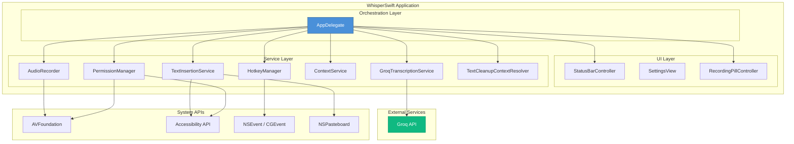

## Data Flow Diagrams

### Main Recording and Transcription Flow

This diagram shows the complete data flow from hotkey press to text insertion:

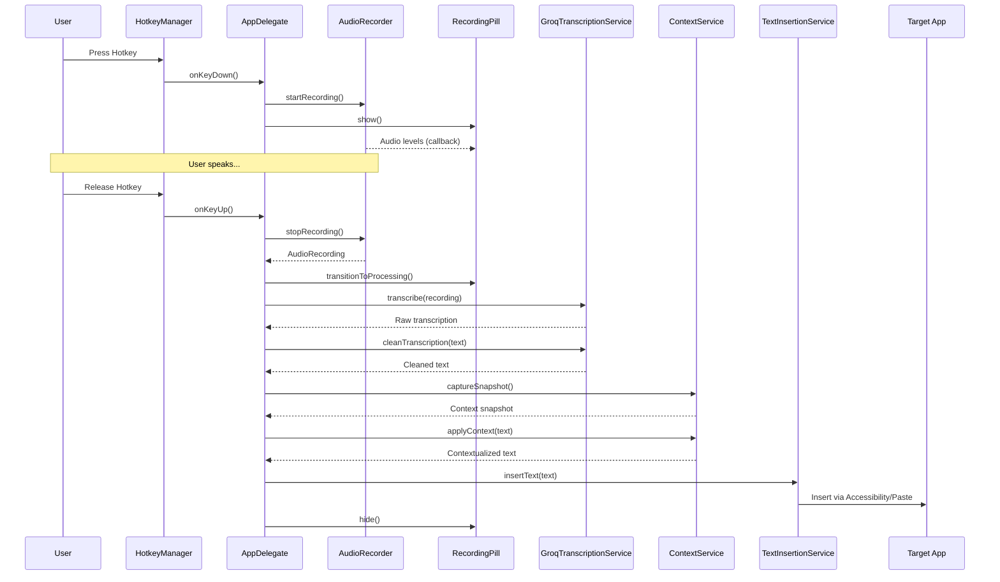

### Audio Processing Pipeline

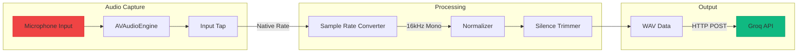

## Component Interaction

### Service Communication Diagram

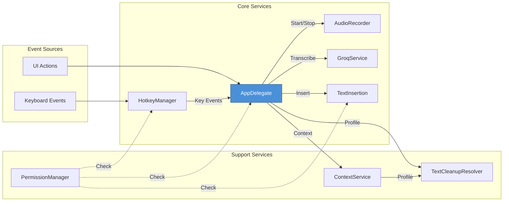

### State Machine Diagram

The AppDelegate manages the application state through this state machine:

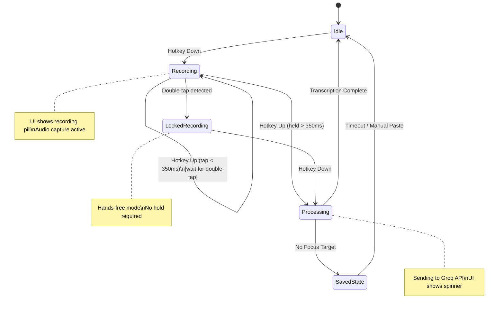

## Service Dependencies

### Dependency Graph

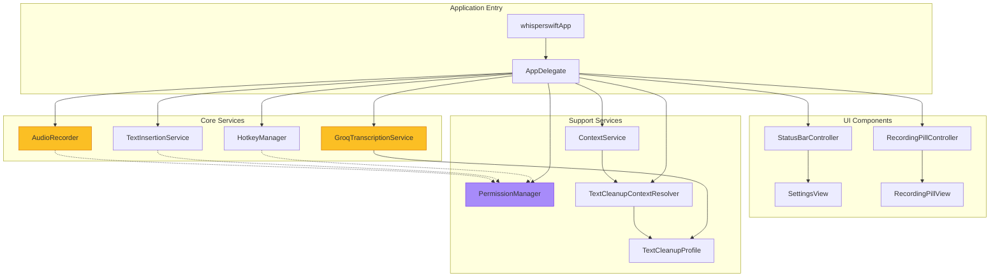

### Framework Dependencies

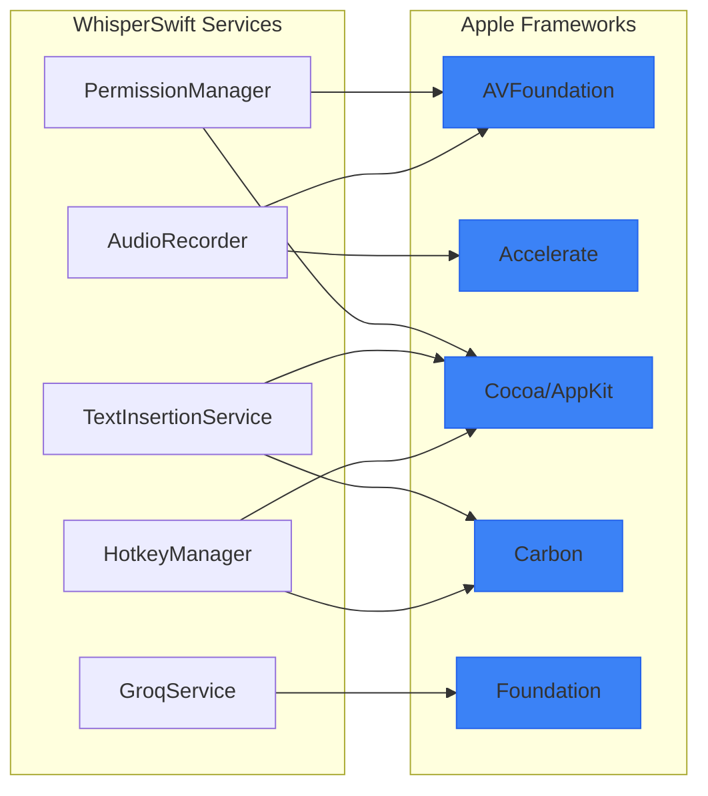

## Detailed Service Flows

### Recording Workflow

The recording workflow handles audio capture with gesture detection:

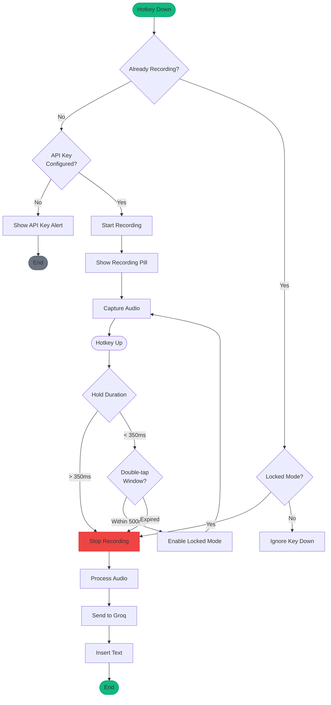

### Transcription Workflow

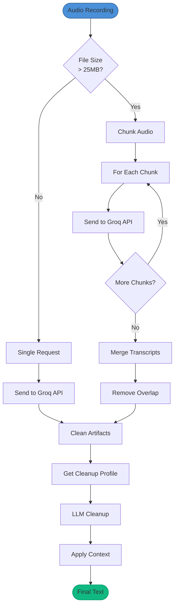

### Permission Handling Flow

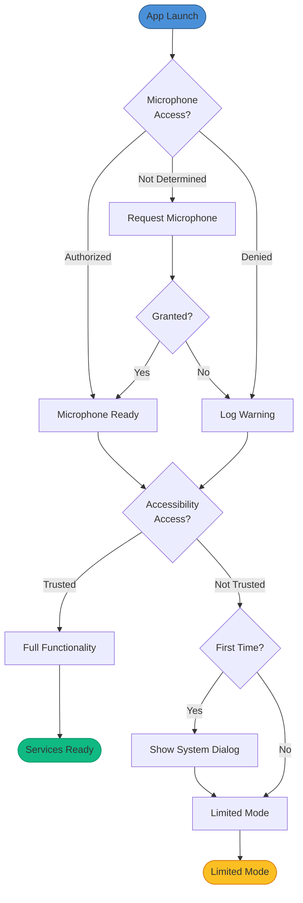

### Text Insertion Flow

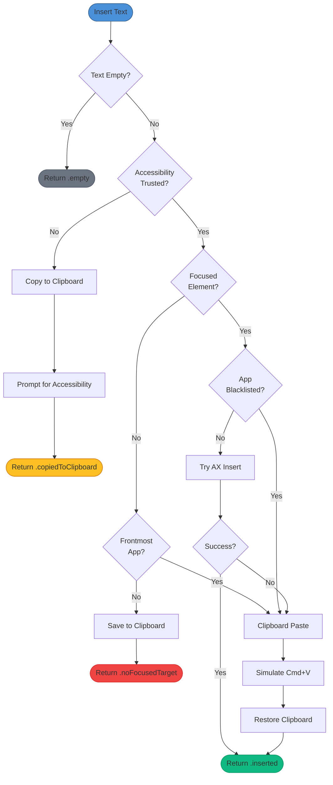

## File Structure

```
whisperswift/
├── AppDelegate.swift              # App lifecycle, service orchestration
├── whisperswiftApp.swift          # SwiftUI entry point (@main)
├── Services/
│   ├── AudioRecorder.swift        # Audio capture (actor)
│   ├── GroqTranscriptionService.swift  # STT API communication (actor)
│   ├── HotkeyManager.swift        # Global hotkey detection
│   ├── TextInsertionService.swift # Text paste/insertion
│   ├── PermissionManager.swift    # Permission handling (singleton)
│   ├── ContextService.swift       # App context detection
│   ├── TextCleanupContextResolver.swift
│   └── TextCleanupProfile.swift
├── UI/
│   ├── StatusBarController.swift  # Menu bar icon and menu
│   ├── SettingsView.swift         # SwiftUI settings window
│   ├── RecordingPillController.swift
│   └── RecordingPillView.swift
└── Assets.xcassets/               # App icons and assets
```

## Security Considerations

### Data Flow Security

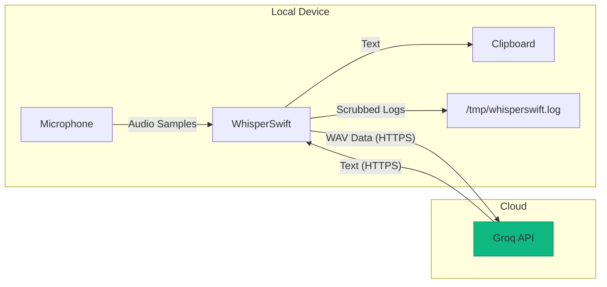

**Security measures:**
- API keys stored locally in UserDefaults (not transmitted except to Groq)
- All API communication over HTTPS
- Audio data not persisted locally after transcription
- Log files scrub sensitive data (API keys, emails, tokens)
- No telemetry or analytics collection
